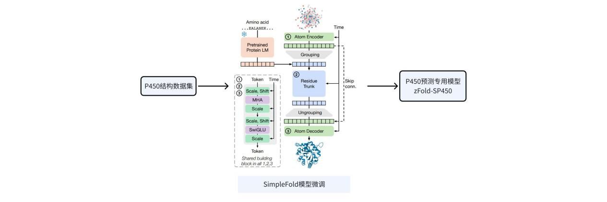
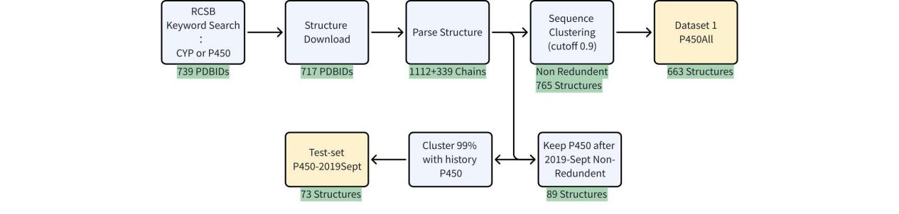
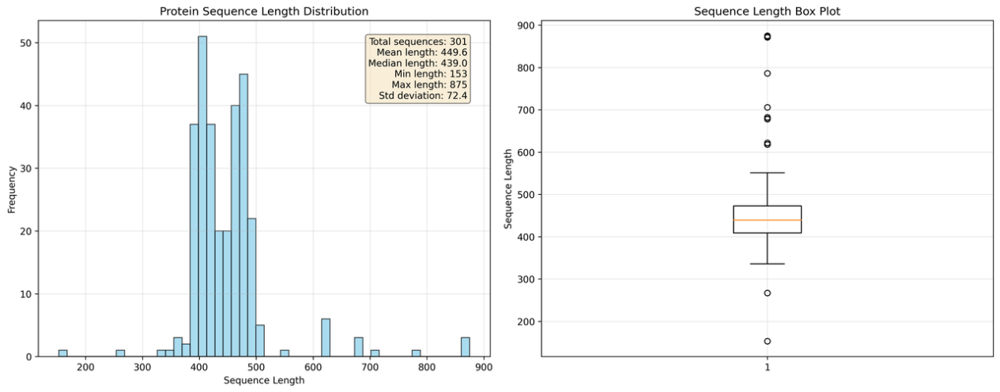
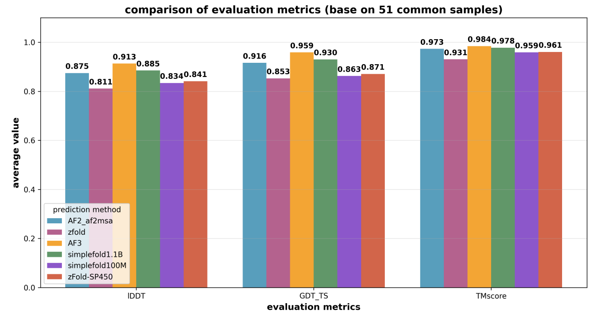
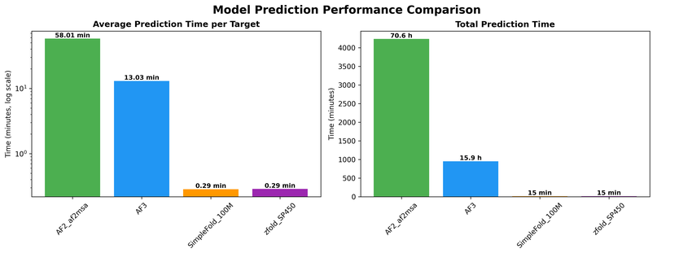

# zFold-SP450 (zFold-v1.5): P450 酶专有结构预测模型

基于 SimpleFold 流匹配框架微调的 P450 元件专用蛋白质结构预测模型。

## 概述

zFold-SP450（zFold-v1.5）以 Apple 发布的 [SimpleFold](https://arxiv.org/abs/2509.18480) 为基座模型，利用 P450 晶体结构数据对其进行领域微调，旨在获得 P450 酶的高效、高精度专用结构预测模型。

SimpleFold 是一种基于流匹配（flow-matching）的蛋白质结构预测模型，完全构建在通用 Transformer 模块之上，摒弃了 AlphaFold 系列中复杂的专用模块（如多序列比对、三角形注意力等）。其生成式训练目标使其天然具备构象集合预测能力。zFold-SP450 在此基础上，通过 P450 领域数据进行微调，在保持 SimpleFold 高效推理能力的同时，提升对 P450 酶的结构预测精度。

<div align="center">
  
  <p><strong>图 1</strong> zFold-v1.5（zFold-SP450）模型通过收集 P450 晶体结构和预测结构来训练和微调 SimpleFold 结构预测模型，实现 P450 结构的专有预测模型。</p>
</div>

## 训练数据

### 数据来源

- **晶体结构数据**：2025 年 9 月 30 日以 "CYP" 为关键词在 RCSB 数据库中检索，获得 739 个 PDB ID，成功下载 719 个结构。
- **数据处理**：将结构按链拆分，每条单链单独保存，共获得 **1,112 条数据**。
- **去冗余**：使用 MMseqs 以 0.9 阈值进行序列聚类过滤，排除与测试集相似度过高的训练数据，得到 **765 条数据**。
- **预处理过滤**：经 SimpleFold 自带预处理流程过滤，去除不符合预设条件的结构，最终获得 **663 条数据**用于训练。

### 数据路径

```
训练数据：/sugon_store/zhuguoliang/project2/P450/dataset/CYPED/P450_cystal
```

### 数据处理流程

<div align="center">
  
  <p><strong>图 2</strong> P450 晶体结构数据的处理流程。</p>
</div>

### 氨基酸长度分布

<div align="center">
  
  <p><strong>图 3</strong> P450 晶体结构蛋白质数据的氨基酸长度分布。</p>
</div>

## 测试数据

- **来源**：从 RCSB PDB 中搜集 2019 年 9 月至 2025 年 10 月的 P450 晶体结构，经关键词匹配后保留含 HEME 分子的结构。
- **数据量**：共计 339 条链，按 90% 序列相似性去冗余后剩余 **73 条链**。
- **有效测试集**：剔除因序列过长导致部分模型预测失败的案例，最终 **51 个案例**用于各模型对比评估。

```
测试数据：/sugon_store/zhengliangzhen/P450/structure_prediction/P450-2019Sept_dataset/all_P450-2019Sept_chains_non-redundent.fasta
```

## 模型训练

### 基座模型

使用 SimpleFold 发布的 **100M 参数预训练模型**作为微调起点：

```
/sugon_store/mahaohui/mahaohui/pocket_generation/ml-simplefold/artifacts/simplefold_100M.ckpt
```

选择该模型的主要原因在于其计算效率——对约 500 个氨基酸残基的序列，仅需 **30 秒**即可完成结构预测。

### 训练配置

| 配置项 | 参数 |
|--------|------|
| 硬件 | NVIDIA V100 32GB × 4 |
| 训练步数 | 5,000 步 |
| 训练耗时 | ~10 小时（4 卡并行） |
| 训练脚本 | `train.py experiment=train` |

### 训练命令

```bash
python train.py experiment=train \
    data.datasets.0.filters='[]' \
    data.filters='[]' \
    model.architecture=configs/model/architecture/foldingdit_100M.yaml \
    +load_ckpt_path=/sugon_store/mahaohui/mahaohui/ml-simplefold/artifacts/simplefold_100M.ckpt
```

## 模型表现

### 精度对比

在 P450 测试集上，比较了不同模型的结构预测精度。zFold 表示 zFold-v1.0 版本，AF2_af2msa 为 AlphaFold2 原始版本，AF3 为 AlphaFold3 版本。SimpleFold-1.1B 和 SimpleFold-100M 分别表示 SimpleFold 不同参数规模的版本。

<div align="center">
  
  <p><strong>图 4</strong> 对于 P450 酶的结构预测的计算精度对比。</p>
</div>

| 模型 | 说明 |
|------|------|
| AF3 (AlphaFold 3) | 精度最高，可能存在数据泄露 |
| SimpleFold-1.1B | 与 AF2 精度相当 |
| AF2 (AlphaFold 2) | 基线水平 |
| **zFold-SP450** (zFold-v1.5) | **相比 SimpleFold-100M 略有提升** |
| SimpleFold-100M | 基座模型 |

> 由于当前各模型对 P450 酶的整体预测精度均已较高，差异不显著。zFold-SP450 相比原始 SimpleFold-100M 有略微提升。后续将通过扩充训练数据和升级基座模型进一步提升精度。

### 计算效率

zFold-SP450 的核心优势在于**计算效率**：

<div align="center">
  
  <p><strong>图 5</strong> 不同结构预测模型的计算时间对比。</p>
</div>

| 模型 | 平均预测耗时（每条结构） |
|------|------------------------|
| **zFold-SP450** | **~20 秒** |
| AlphaFold 3 | ~13 分钟 |
| AlphaFold 2 | ~1 小时 |

相较 AF2 和 AF3，zFold-SP450 的计算效率提升 **30 倍以上**，特别适用于大规模结构建模、突变体结构预测和复合体建模等场景。

## 推理

### 使用微调模型进行预测

```bash
simplefold \
    --simplefold_model simplefold_100M \
    --custom_ckpt_path /path/to/zfold-sp450_checkpoint.ckpt \
    --num_steps 500 \
    --nsample_per_protein 8 \
    --plddt \
    --fasta_path /path/to/target.fasta \
    --output_dir /path/to/output
```

## 后续优化方向

1. **扩充训练数据**：引入课题一发现的 P450 新元件，以及 AlphaFold-DB 中 P450 元件的预测结构
2. **升级基座模型**：使用更大的语言模型模块（如 SimpleFold-1.1B）进行微调
3. **预期提升**：在保持高计算效率的同时，进一步提升 P450 元件的结构预测精度

## 环境安装

```bash
conda create -n simplefold python=3.10
conda activate simplefold
python -m pip install -U pip build; pip install -e .
```

## 参考文献

```bibtex
@article{simplefold,
  title={SimpleFold: Folding Proteins is Simpler than You Think},
  author={Wang, Yuyang and Lu, Jiarui and Jaitly, Navdeep and Susskind, Josh and Bautista, Miguel Angel},
  journal={arXiv preprint arXiv:2509.18480},
  year={2025}
}
```

---

# SimpleFold 原始文档

> 以下为 SimpleFold 原始说明文档的简化版本，包含安装、推理、评估与训练等基础使用方式。

## 简介

SimpleFold 是首个基于流匹配（flow-matching）的蛋白质结构预测模型，完全使用通用 Transformer 层构建，不依赖三角形注意力或配对表示偏置等复杂模块。模型通过生成式流匹配目标进行训练，最大规模达 3B 参数，在超过 860 万蒸馏蛋白质结构和实验 PDB 数据上训练，在 CASP14 和 CAMEO22 等标准基准上取得了与最先进模型相当的性能。

## 安装

```bash
git clone https://github.com/apple/ml-simplefold.git
cd ml-simplefold
conda create -n simplefold python=3.10
conda activate simplefold
python -m pip install -U pip build; pip install -e .
```

Apple Silicon 上使用 MLX 后端：

```bash
pip install mlx==0.28.0
pip install git+https://github.com/facebookresearch/esm.git
```

## 推理

```bash
simplefold \
    --simplefold_model simplefold_100M \
    --num_steps 500 --tau 0.01 \
    --nsample_per_protein 1 \
    --plddt \
    --fasta_path [FASTA_PATH] \
    --output_dir [OUTPUT_DIR] \
    --backend [mlx, torch]
```

## 训练数据准备

### 处理 mmcif 结构

需要安装并启动 Redis 服务器：

```bash
wget https://boltz1.s3.us-east-2.amazonaws.com/ccd.rdb
redis-server --dbfilename ccd.rdb --port 7777
```

处理 mmcif 文件：

```bash
python src/simplefold/process_mmcif.py \
    --data_dir [MMCIF_DIR] \
    --out_dir [OUTPUT_DIR] \
    --use-assembly
```

Tokenize 处理后的结构：

```bash
python src/simplefold/process_structure.py \
    --target_dir [TARGET_DIR] \
    --token_dir [TOKEN_DIR]
```

### 训练

```bash
python train experiment=train
```

FSDP 策略训练：

```bash
python train_fsdp.py experiment=train_fsdp
```

## 引用

```bibtex
@article{simplefold,
  title={SimpleFold: Folding Proteins is Simpler than You Think},
  author={Wang, Yuyang and Lu, Jiarui and Jaitly, Navdeep and Susskind, Josh and Bautista, Miguel Angel},
  journal={arXiv preprint arXiv:2509.18480},
  year={2025}
}
```

## 许可证

请参阅仓库中的 [LICENSE](LICENSE) 和 [LICENSE_MODEL](LICENSE_MODEL) 文件。
